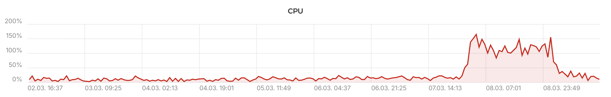

rCTF is intentionally lightweight. A single-node deployment of the bundled container is enough for almost any event, and horizontal scaling only kicks in at the upper end of CTF traffic.

## Resource expectations

The API process is a single Bun runtime, and the frontend is a static SvelteKit build served by nginx. The leaderboard worker runs as a Bun `Worker` thread inside the API process by default. PostgreSQL and Redis are external and follow their normal tuning.

In practice the platform barely touches the box it runs on. [DiceCTF 2026 Quals](https://2026.ctf.dicega.ng/scores), a large and well-attended event, ran the whole platform as a single Docker container on one Hetzner `CPX62` instance (16 vCPU / 32 GiB RAM). Peak CPU across the whole machine (including the databases) sat around **1.6 cores**, as shown below.



:::warning[RAM data lost]
Memory metrics for the same window weren't retained. Expect a similarly modest footprint, since the API process is a single Bun runtime and the leaderboard worker is a Bun `Worker` thread, not a separate process.
:::

:::note[Deliberately overprovisioned]
The `CPX62` was definitely an overshoot. DiceCTF 2026 Quals was the first public event running rCTF v2, so if something unexpected blew up in CPU or memory during the CTF, we wanted enough runway to diagnose and patch without the platform tipping over in the meantime. A much smaller instance would have been plenty for the actual observed load. `CPX62` works, but don't treat it as a recommended baseline.
:::

A VPS with 2 CPU cores and 4 GiB RAM is a comfortable starting point, and is what the [VPS setup walkthrough](/docs/meta/running-a-successful-ctf/setup) targets. PostgreSQL and Redis sit alongside in the bundled `compose.yml{:file}` and dominate steady-state memory more than the rCTF container itself.

## Instance types

The `<red>instanceType</red>` config option (environment variable `RCTF_INSTANCE_TYPE{:sh}`) selects what an API process runs.

| Value                          | API server  | Leaderboard worker thread |
| ------------------------------ | ----------- | ------------------------- |
| `<green>all</green>` (default) | Yes         | Yes                       |
| `<green>frontend</green>`      | Yes         | No                        |
| `<green>leaderboard</green>`   | Health only | Yes                       |

Every type binds an HTTP server on `PORT{:sh}` (default `3000{:ts}`) - including `<green>leaderboard</green>`, which serves only the `/api/healthz{:sh}` and `/api/readyz{:sh}` probes, not the API routes, so an orchestrator can still health-check it.

```yaml title="rctf.d/02-scaling.yaml"
instanceType: frontend # or 'leaderboard' or 'all'
```

## Horizontal scaling

To scale beyond a single container, run any number of `<green>all</green>` containers behind a load balancer. They share PostgreSQL and Redis, and a Postgres advisory lock coordinates the one piece of work that has to be a singleton (the leaderboard worker), so you don't have to split roles by hand.

:::note[Splitting roles is optional]
Running several `all` replicas is the simplest setup. You can split into separate `frontend` and `leaderboard` replicas to keep the worker's CPU away from request serving, but you don't need to for correctness: the leader lock parks any extra leaderboard workers on standby instead of letting them race.
:::

:::warning[No transaction-pooling proxies]
Point `<red>database.sql</red>` at Postgres directly or through a session-pooling proxy: leader election and the migration lock take **session-scoped** advisory locks. Transaction-pooling setups (PgBouncer in `transaction` mode, multiplexing proxies) route each statement to a different backend, which strands the lock on a pooled server connection and silently halts leaderboard updates.
:::

:::note[Forced leaderboard updates]
API mutations and the dynamic-scoring webhook wake the active leaderboard worker through Redis pub/sub on the `leaderboard:force-update{:sh}` and `leaderboard:recompute-challenge{:sh}` channels. Only the current leader acts on them immediately; a worker that takes over first recomputes every challenge, covering requests that landed while there was no leader. As long as every process shares the same Redis, forced updates land within the worker's next tick regardless of which replica received the request.
:::

## Health checks

The API exposes two unauthenticated endpoints for load balancers and orchestrator probes. The bundled nginx proxies them under `/api{:sh}`.

| Endpoint | Purpose | Behavior |
| --- | --- | --- |
| `/api/healthz{:sh}` | Liveness | Returns `<green>200</green>` while the process is up. |
| `/api/readyz{:sh}` | Readiness | Returns `<green>200</green>` when PostgreSQL and Redis are both reachable, and `<red>503</red>` otherwise. Use it to gate load-balancer traffic. |

## Graceful shutdown

On `SIGTERM{:sh}` or `SIGINT{:sh}`, the API stops accepting new connections, drains in-flight requests, and stops the leaderboard worker. Stopping the worker releases its advisory lock, so a standby takes over within its next poll (≤5s) instead of waiting for Postgres to notice the dropped session. A hard timeout (`<red>shutdownTimeout</red>`, default 30s) forces the process to exit if draining stalls, so give your orchestrator a termination grace period at least that long (the bundled container ships `stopwaitsecs=35{:sh}` in supervisord and `stop_grace_period: 45s{:yaml}` in `compose.yml{:file}`). A second signal skips the drain and exits immediately.

If a leader dies **without** closing its connection (host crash, network partition), the lock stays held until Postgres reaps the dead session - by default that relies on OS TCP keepalives and can take a long time. For multi-node deployments, tighten `tcp_keepalives_idle{:sh}`/`tcp_keepalives_interval{:sh}`/`tcp_keepalives_count{:sh}` on Postgres so dead peers are noticed and a standby can take over promptly. (Avoid `idle_session_timeout{:sh}`: it also kills healthy idle sessions, including the one holding the migration lock.)

## Deployment templates

There are no first-party deployment templates for horizontally scaled rCTF yet (no Helm chart, no multi-replica `compose.yml{:file}`, no Terraform module). It's on the roadmap and will land here when ready. For single-box events, the bundled `compose.yml{:file}` is still the simplest option.
