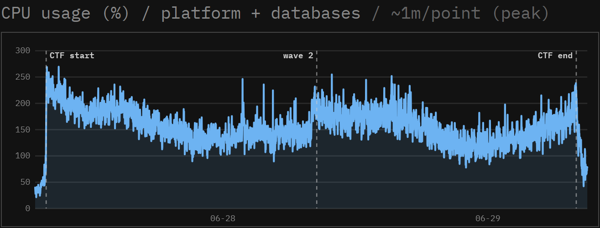

Most events can run rCTF on one server. Multiple application containers are only necessary for unusually large competitions or deployments that need redundancy.

## Resource expectations

[SekaiCTF 2026](https://ctf.sekai.team/scores) ran rCTF as a single application container on a Hetzner `CPX62` instance with 16 vCPUs and 32 GiB of RAM. At peak, the entire server, including PostgreSQL and Redis, used about **2.6 CPU cores**.



The [VPS setup walkthrough](/meta/running-a-successful-ctf/setup) starts with 2 CPU cores and 4 GiB of memory. In the bundled `compose.yml{:file}`, PostgreSQL and Redis use more idle memory than the rCTF container itself.

## Instance types

The `<red>instanceType</red>` config option (environment variable `RCTF_INSTANCE_TYPE{:sh}`) selects what an API process runs.

| Value                          | API server  | Leaderboard worker thread |
| ------------------------------ | ----------- | ------------------------- |
| `<green>all</green>` (default) | Yes         | Yes                       |
| `<green>frontend</green>`      | Yes         | No                        |
| `<green>leaderboard</green>`   | Health only | Yes                       |

Every instance type listens on `PORT{:sh}`, which defaults to `3000{:ts}`. A `<green>leaderboard</green>` instance only serves `/api/healthz` and `/api/readyz`, allowing a deployment system to check its health even though it does not serve normal API routes.

```yaml title="rctf.d/02-scaling.yaml"
instanceType: frontend # or 'leaderboard' or 'all'
```

## Horizontal scaling

To scale beyond one container, run several `<green>all</green>` instances behind a load balancer and connect them to the same PostgreSQL and Redis services. A PostgreSQL advisory lock ensures that only one instance runs the leaderboard worker at a time. The bundled Compose file is for one server, so a multi-server deployment needs its own load balancer and service configuration.

:::note[Splitting roles is optional]
Several `all` replicas are the simplest arrangement. Separate `frontend` and `leaderboard` replicas only when the worker should have dedicated CPU.
:::

:::warning[No transaction-pooling proxies]
Connect `<red>database.sql</red>` directly to PostgreSQL or through a proxy that preserves database sessions. Leader election and migrations use **session-scoped advisory locks**, which must remain on the same PostgreSQL connection. Transaction-pooling modes, including PgBouncer in `transaction` mode, can leave the lock on a different connection and stop leaderboard updates.
:::

:::note[Forced leaderboard updates]
Changes that affect scores notify the active leaderboard worker through Redis. If leadership changes, the new worker recalculates every challenge before continuing. All rCTF instances must use the same Redis service for these notifications to work.
:::

## Health checks

The API provides two public endpoints for load balancers and deployment health checks. The bundled nginx exposes them under `/api`.

| Endpoint | Purpose | Behavior |
| --- | --- | --- |
| `/api/healthz` | Liveness | Returns `<green>200</green>` while the process is up. |
| `/api/readyz` | Readiness | Returns `<green>200</green>` when PostgreSQL and Redis are both reachable, and `<red>503</red>` otherwise. Use it to gate load-balancer traffic. |

## Graceful shutdown

On `SIGTERM{:sh}` or `SIGINT{:sh}`, the API stops accepting connections, drains active requests, and releases the leaderboard lock for a standby. The `<red>shutdownTimeout</red>` defaults to 30 seconds, so the orchestrator's termination grace period must be at least that long. A second signal exits immediately.

After a host crash or network partition, Postgres holds the leaderboard lock until it detects the dead connection. Multi-node deployments should shorten the Postgres `tcp_keepalives_idle{:sh}`, `tcp_keepalives_interval{:sh}`, and `tcp_keepalives_count{:sh}` settings. Do not use `idle_session_timeout{:sh}`, which can also kill healthy sessions holding advisory locks.
